# 🤖 ResumeAI — AI-Powered Career Assistant

An all-in-one AI-powered web application that helps job seekers write better resumes, find relevant jobs, and ace interviews — all from a single platform.

---

## 🎯 Problem It Solves

Fresh graduates face three major challenges:
- Writing an effective, ATS-friendly resume
- Finding relevant jobs
- Preparing for interviews

Existing tools are expensive, scattered, or impersonal. **ResumeAI solves all three in one free platform.**

---

## ✨ Features

### 📄 Resume Management
Upload multiple PDF resumes, switch between them anytime. All AI features use your selected resume as context.

### 📊 ATS Resume Analyzer
AI evaluates your resume like a real ATS system — returns an ATS score, strengths, missing keywords, and improvement suggestions.

### 🏗️ Resume Builder
Build a resume from scratch using an interactive form. Choose from professionally designed templates and export as **PDF or DOCX**.

### 💼 Live Job Browser
Fetches real-time job listings via RapidAPI. Search by title, location, and category without leaving the platform.

### 🎯 AI Job Matching
Compares your resume against job descriptions using keyword similarity scoring. Set your own matching threshold (e.g. 60%+).

### 🎤 Interview Preparation
Role-specific interview questions to help you practice before the simulation.

### 🤖 AI Interview Simulator (3 Modes)
| Mode | Description |
|------|-------------|
| **Text** | Chat-style interview with AI |
| **Voice** | Speak answers aloud — AI reads questions using text-to-speech |
| **Video** | Full video simulation with animated AI avatar, live camera, speech analytics |

**End-of-interview report includes:** overall score /100, confidence level, STAR method rating, per-question feedback, sample strong answers, and speech analytics (WPM, filler words, answer duration).

---

## 🛠️ Tech Stack

| Component | Technology |
|-----------|------------|
| Backend | Python, Flask |
| Frontend | HTML, CSS, JavaScript |
| Database | SQLite |
| Primary AI | Groq API (Llama 3.3 70B) |
| Secondary AI | Google Gemini API |
| Voice & Video | Web Speech API |
| Authentication | Flask-Login |
| Job Listings | RapidAPI |
| Export | PDF & DOCX generation |

---

## 🔑 Key Concepts Applied
- **Prompt Engineering** — Custom system prompts for each AI feature
- **Multi-turn Conversation** — Full chat history maintained per session
- **Fallback Architecture** — Auto-switches from Groq to Gemini if rate-limited
- **Speech Analytics** — Real-time WPM, filler word detection, answer duration
- **REST API Integration** — Gemini, Groq, and RapidAPI via HTTP requests

---

## 📸 Screenshots

| Feature | Preview |
|---------|---------|
| Front Page |  |
| Login | 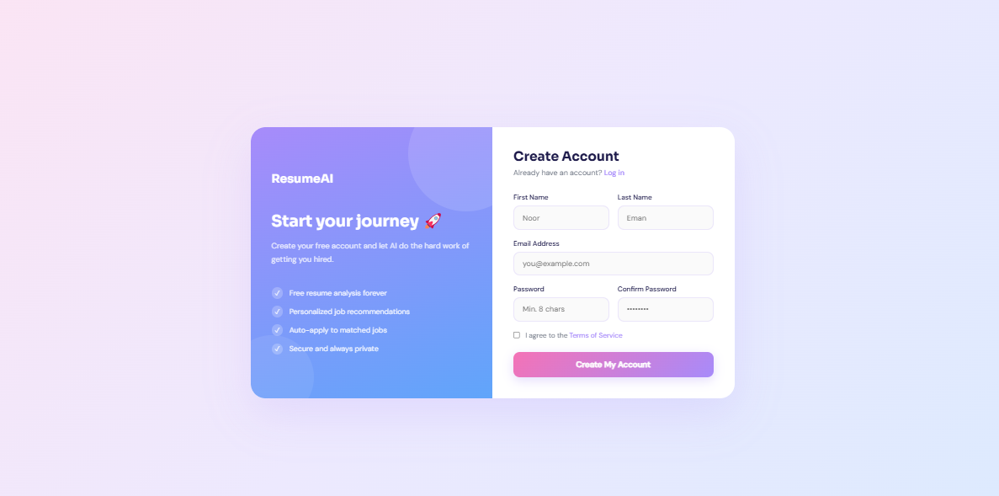 |
| Dashboard | 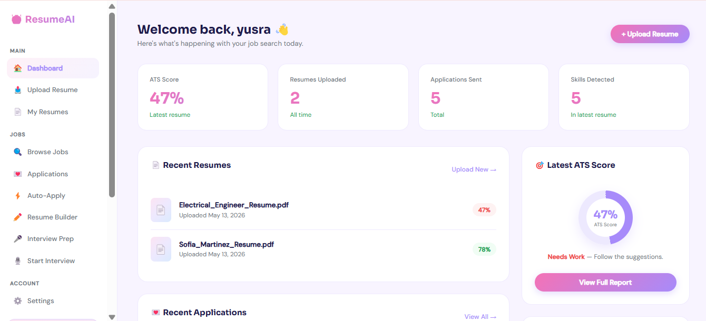 |
| Upload Resume | 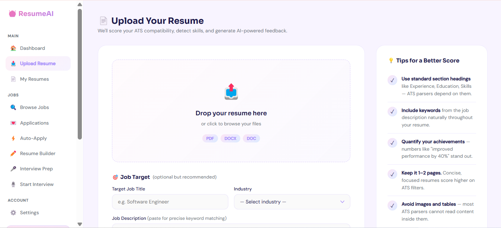 |
| My Resumes | 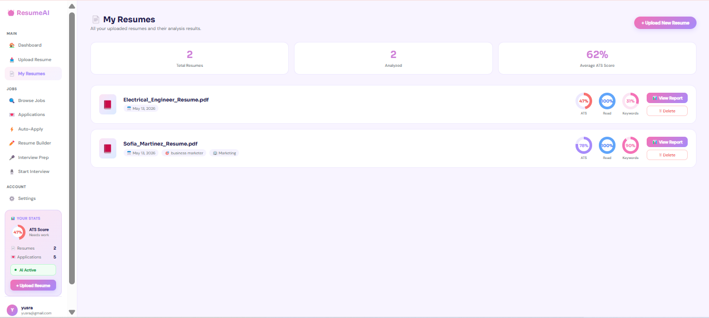 |
| Resume Builder | 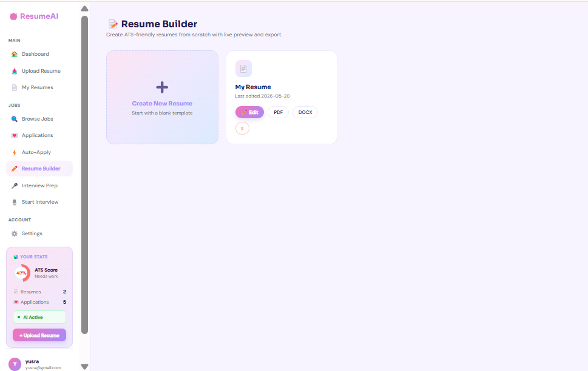 |
| Resume Templates | 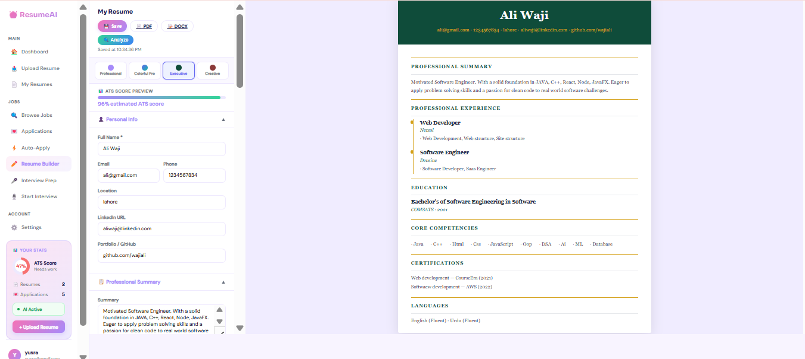 |
| Browse Jobs | 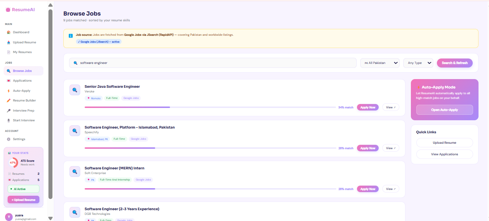 |
| Auto Apply | 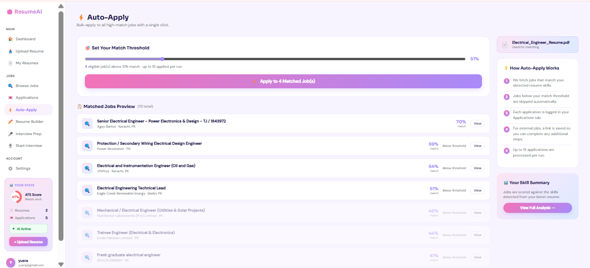 |
| My Applications | 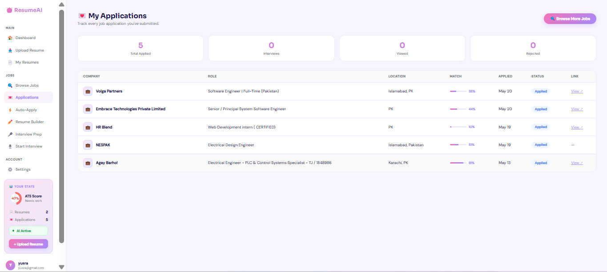 |
| Interview Prep | 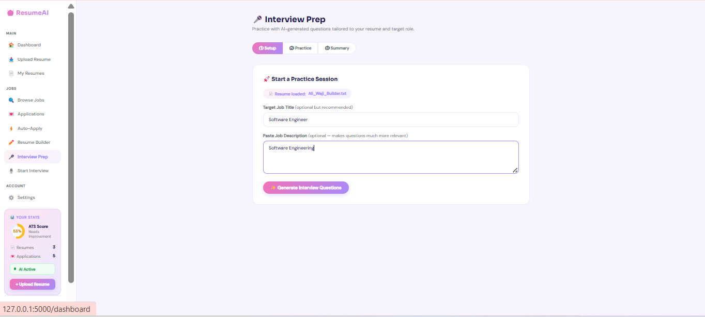 |
| Prep Questions | 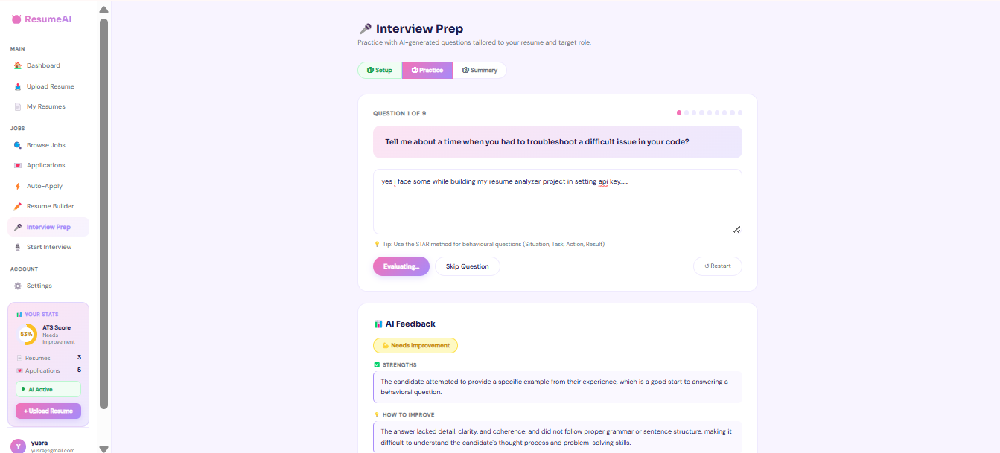 |
| Interview Setup | 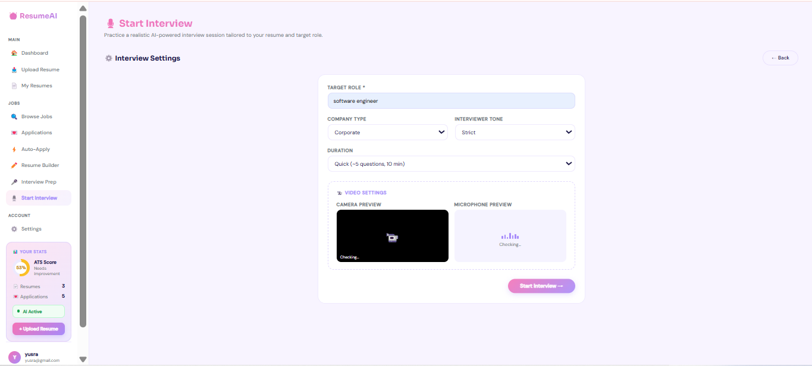 |
| Text Interview | 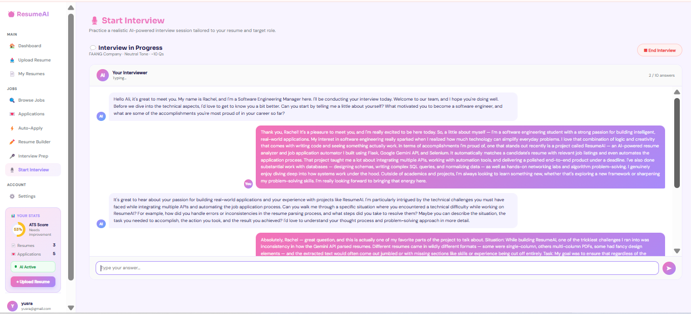 |
| Voice Interview | 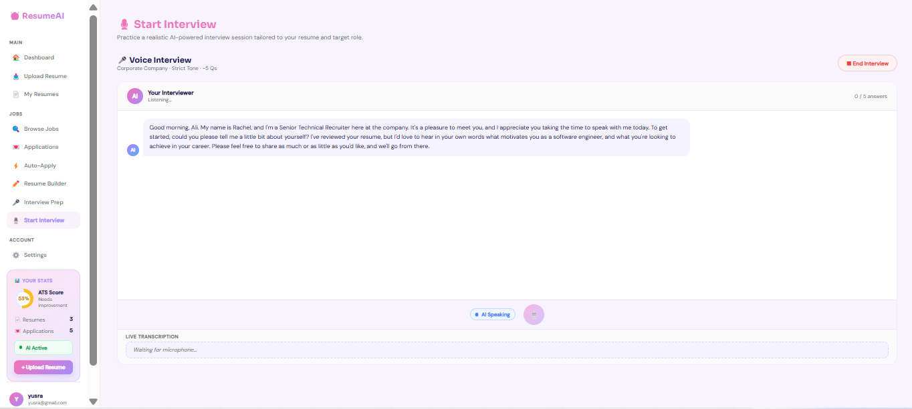 |
| Video Interview | 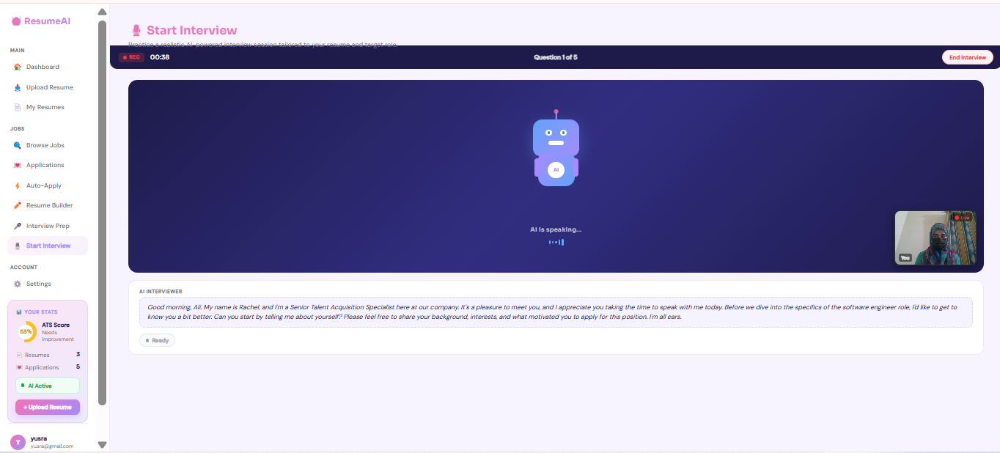 |
| 1-on-1 AI Interview |  |
| Interview Report | 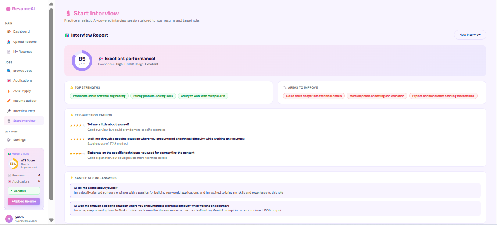 |
| Video Report | 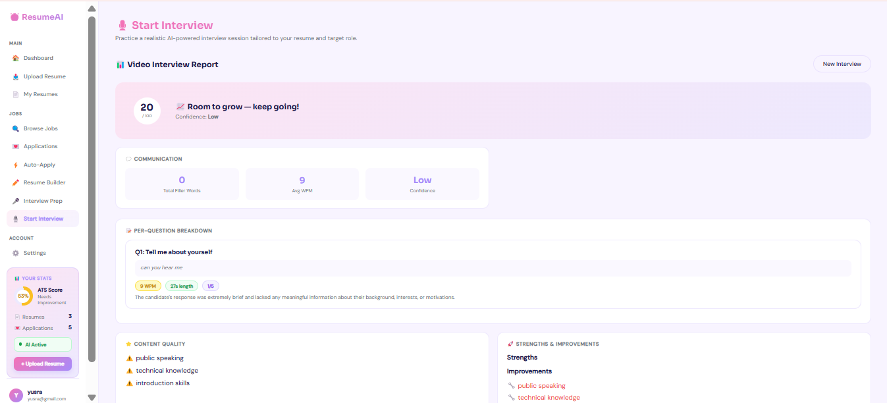 |
| Settings | 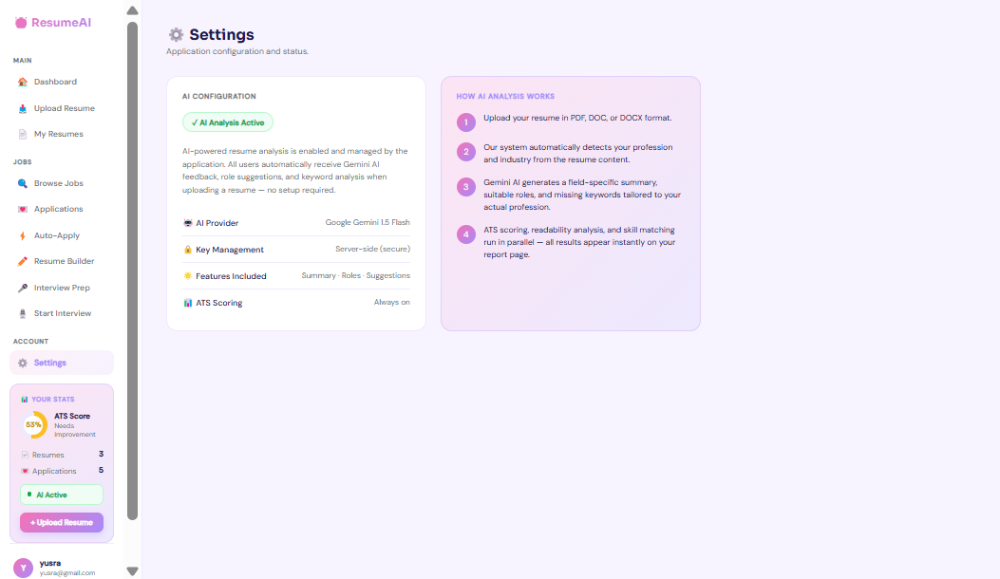 |

## 🎥 Demo Video

[▶️ Watch Demo](demo/demo-video.mp4)

---

## ⚙️ Setup & Installation

```bash
# Clone the repo
git clone https://github.com/nooruleman2006/Resume-Analyzer.git
cd Resume-Analyzer

# Install dependencies
pip install -r requirements.txt

# Create your .env file
cp .env.example .env
# Add your API keys to .env

# Run the app
python app.py
```

---

## 🔐 Environment Variables

Create a `.env` file with these keys:
SESSION_SECRET=
SECRET_KEY=
GEMINI_API_KEY=
GEMINI_API_KEY_2=
RAPIDAPI_KEY=
GROQ_API_KEY=
GROQ_KEY_2=

---

## 👤 Author

**Noor Ul Eman** — [GitHub](https://github.com/nooruleman2006)